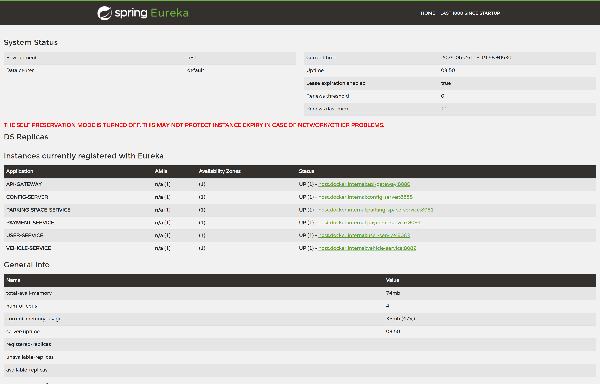

# 🚗 Smart Parking Management System (SPMS)

A **microservice-based**, cloud-native platform for **real-time parking space management**, built to support smart city initiatives and improve urban mobility.

---

## 🌐 Overview

The **Smart Parking Management System (SPMS)** tackles the growing challenge of urban parking by enabling:

- 🔍 Real-time parking availability tracking
- 🅿️ Reservation & digital space management
- 💳 Secure payment processing
- 📈 Usage analytics by city, zone, and owner

Built using a **Spring Boot microservice architecture**, SPMS supports dynamic scaling, modular deployment, and easy maintainability.

---

## 🧠 Business Objectives

- Allow users to search, reserve, and pay for parking in real time  
- Help parking owners manage and track space usage dynamically  
- Simulate vehicle entry/exit for real-time updates  
- Maintain booking logs for auditing and reporting  
- Reduce traffic congestion and increase parking efficiency  

---

## 🛠️ Technologies & Tools

| Tool/Tech                | Purpose |
|--------------------------|---------|
| **Spring Boot**          | Core framework for all microservices |
| **Spring Cloud Eureka**  | Service discovery and registration |
| **Spring Cloud Gateway** | Central API Gateway |
| **Spring Cloud Config**  | Centralized configuration management |
| **Spring Web**           | REST API development |
| **Postman**              | API testing and validation |
| **Optional:** Node.js / Python Flask | Lightweight services (if needed) |

---

## 🧩 Microservice Architecture

### 1. 🚀 **Service Registry** (Eureka)
- Dynamic service registration & discovery  
- Removes hard-coded dependencies

### 2. ⚙️ **Configuration Server**
- Centralized `application.yml` or `properties` file for all services  
- Dynamic reload without redeployment

### 3. 🌐 **API Gateway**
- Routes client requests to appropriate microservices  
- Leverages Eureka for intelligent routing

### 4. 🧾 **Core Microservices**
| Service | Responsibilities |
|--------|------------------|
| **User Service** | User registration, login, profile, booking history |
| **Parking Space Service** | Manage parking spaces, availability, and reservations |
| **Vehicle Service** | Vehicle registration, entry/exit simulation |
| **Payment Service** | Mock payment flow and digital receipt generation |

---

## 📁 Folder Structure

```

SPMS/
├── user-service/
├── vehicle-service/
├── parking-service/
├── payment-service/
├── eureka-server/
├── config-server/
├── api-gateway/
├── postman\_collection.json
├── docs/
│   └── screenshots/
│       └── eureka\_dashboard.png
└── README.md

````

---

## 📚 Resources

- 📬 [Postman Collection](./Parking_Management_System.postman_collection.json)  
- 📸 

---
## 🏁 Conclusion

The **Smart Parking Management System (SPMS)** demonstrates how modern urban challenges can be tackled using intelligent, modular, and scalable technology. By leveraging Spring Boot microservices and cloud-based components like Eureka, Config Server, and Gateway, the system provides a seamless experience for users, parking owners, and city operators.

This project not only promotes efficient space utilization but also aligns with the vision of **smart city infrastructure**, offering:

- 🚦 Reduced traffic congestion
- 🔐 Secure and traceable digital transactions
- 📱 Real-time service accessibility
- 🔁 Scalable architecture for future growth

---
